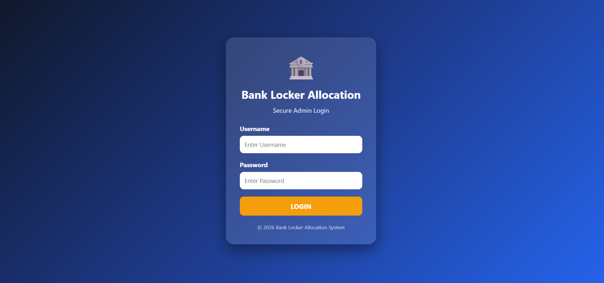
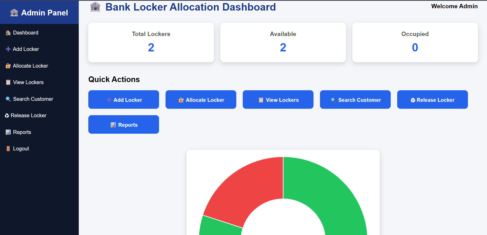
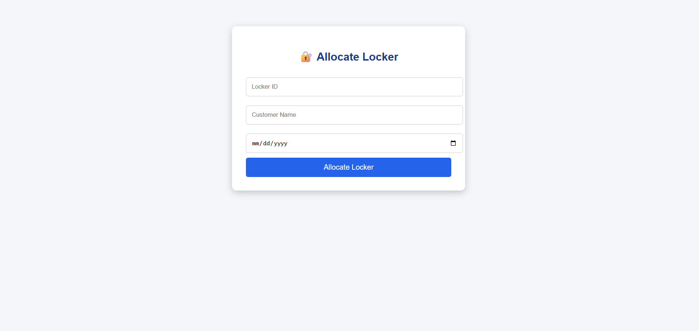
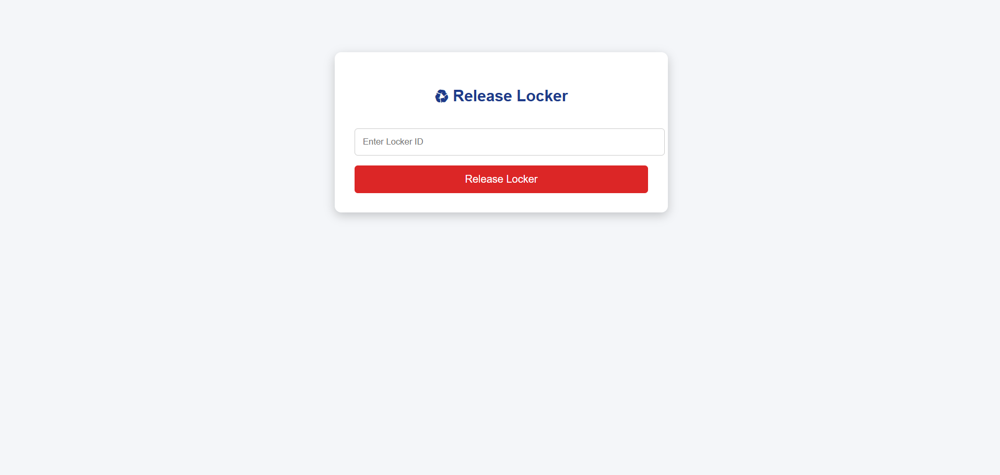
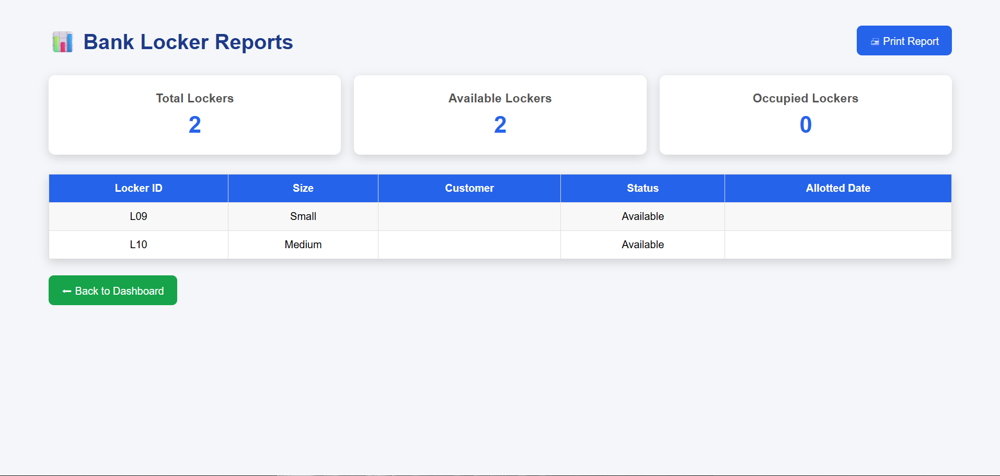

# AI-Based Bank Locker Allocation and Security System

## 📌 Project Overview
The AI-Based Bank Locker Allocation and Security System is a secure locker management application developed to simplify locker allocation, release, and monitoring. The system improves security and reduces manual work by providing an efficient locker management process.

## ✨ Features
- Secure User Login
- Dashboard
- Locker Allocation
- Locker Release
- Locker Availability Status
- Reports
- User-Friendly Interface

## 🛠 Technologies Used
- Python
- Flask
- HTML
- CSS
- JavaScript
- SQLite

## 📂 Project Structure
AI-Bank-Locker-Allocation-System
│── app.py
│── requirements.txt
│── lockers_data.json
│── templates/
│    ├── login.html
│    ├── dashboard.html
│    ├── add_locker.html
│    ├── view_lockers.html
│    ├── allocate.html
│    ├── release.html
│    ├── reports.html
│    └── search.html
│── static/

## 🚀 How to Run
1. Clone the repository
2. Install the required Python packages
3. Run:
```bash
python app.py
```

## 📷 Screenshots

### Login


### Dashboard


### Allocate Locker


### Release Locker


### Report


## 👨‍💻 Author
**Dineshkumar S**

- B.Tech Information Technology
- Ganadipathy Tulsi's Jain Engineering College
